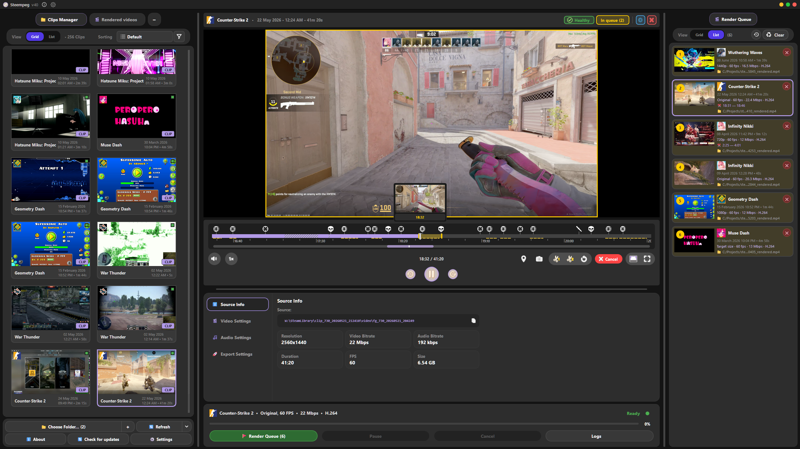
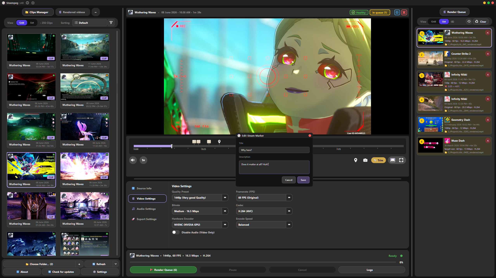
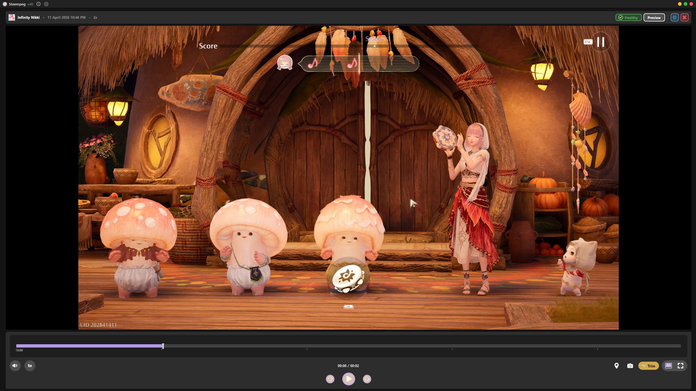
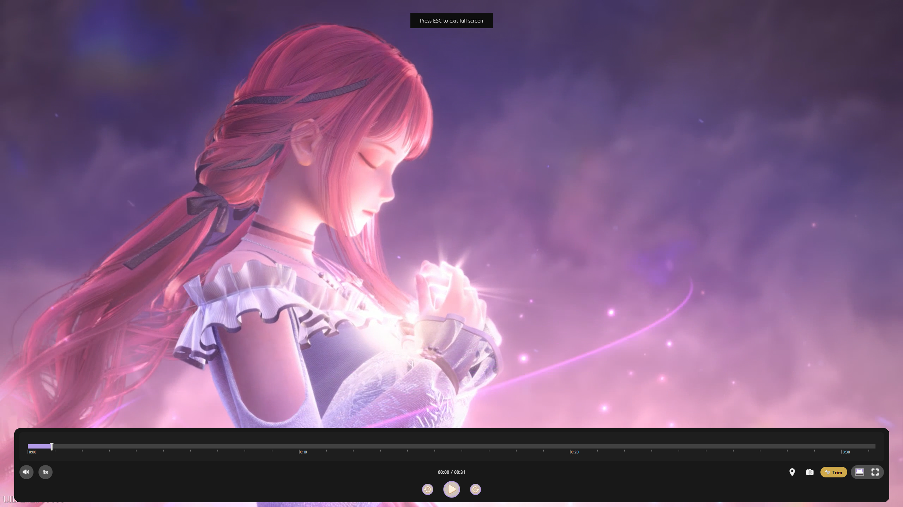

<p align="center">
  
</p>

<h1 align="center">Steempeg</h1>

<p align="center">
  <strong>A fast, hardware-accelerated renderer for Steam Game Recording clips.</strong><br>
  Recover broken recordings, trim with precision, and export in one click — no Python, no command line.
</p>

<p align="center">
  <a href="https://github.com/applejuicy23/steempeg/releases/latest">
    
  </a>
  
  
  
  
  <a href="https://github.com/applejuicy23/steempeg/stargazers">
    
  </a>
  <a href="https://github.com/applejuicy23/steempeg/releases">
    
  </a>
</p>

<p align="center">
  
</p>

<p align="center">
  <a href="#-features">Features</a> ·
  <a href="#-screenshots">Screenshots</a> ·
  <a href="#-getting-started">Getting Started</a> ·
  <a href="#-changelog">Changelog</a> ·
  <a href="#-credits">Credits</a>
</p>

---

## ✨ Features

### Overview

| | |
|---|---|
| **Clips library** | Grid & List views, smart filters (game, date, duration, health), multi-select |
| **Player** | Trim mode, timeline markers, sniper thumbs, theatre & immersive fullscreen |
| **Render engine** | NVENC / CPU, H.264–AV1, VP9, Divine / Goddess quality ladder + honest bitrate cap |
| **Render queue** | Grid & list views, batch export, duplicates allowed, history, persistent between sessions |
| **Steam-aware** | Auto-discovers clip folders, repairs broken block-spliced recordings |
| **Export** | MP4 / MKV / MOV / WebM, Share · Edit · Web presets, audio-only / mute, stream copy |
| **Shells** | Desktop layout or Portable theatre — pick once at startup |
| **Platforms** | Windows zip, Linux portable pack, Steam Deck channel (`*_steamdeck.zip`) |

### Library & health

- Multi-folder Steam clip roots, refresh, and smart sort (name, date, duration, health).
- Clip health pills (good / warn / dead / cured) with filters that only show chips when they apply.
- Rendered Videos tab with its own filters, zoom reset on select, and purple timeline bar from real export duration.

### Player & timeline

- Trim in/out with per-clip memory, marker editing, screenshots, speed & volume chrome.
- Timeline sniper thumbs with warm neighbors; 3-part playhead needle + translucent hover ghost.
- Zoom overview strip with a `*` mark that tracks where the scroller sits in the full clip.
- Theatre mode and immersive fullscreen without the old maximized-window Aero flash on exit.

### Render & quality

- Quality presets from source height up through **2160p (Divine)** and **4320p (Goddess)** — taller Goddess presets scale bitrate by area; unusable (taller-than-source) presets stay hidden.
- Queue cards with progress, history dialog, and Settings for render priority / pause-preview while encoding.
- Target file size and Share / Edit / Web presets alongside classic bitrate modes.

### Shells, settings & updates

- **Desktop** vs **Portable** shell chooser; Portable locks into theatre with Choose a Clip / Render sheets.
- Settings dialog: updates on startup, notifications, hints reset, logs/cache, performance prefs.
- Title-bar About `(i)`, Settings, and Update Available chip; Update Center uses per-platform channels so Windows / Linux / Deck never steal each other’s zips.

---

## 📸 Screenshots

<p align="center"><em>Clips manager with filters, grid view & render queue</em></p>
<p align="center">
  
</p>

<p align="center"><em>List view, marker editing & batch queue</em></p>
<p align="center">
  
</p>

<p align="center"><em>Grid library & source info panel</em></p>
<p align="center">
  
</p>

<p align="center"><em>Theatre / Portable — immersive playback</em></p>
<p align="center">
  
</p>

---

## 🚀 Getting Started

No installer. Extract and run. Pick the zip that matches your platform from **[Releases](https://github.com/applejuicy23/steempeg/releases/latest)**.

| Platform | Download | Launch |
|---|---|---|
| **Windows** | `Steempeg_vXX.zip` (untagged) | `Steempeg.exe` |
| **Linux** | `Steempeg_vXX_linux.zip` | `Steempeg-linux` / `Steempeg.sh` |
| **Steam Deck** | `Steempeg_vXX_steamdeck.zip` | same as Linux (`Steempeg-linux`) |

### Windows

1. Download **`Steempeg_vXX.zip`** from Releases.
2. Extract to any folder.
3. Run **`Steempeg.exe`**.
4. Point the app at your Steam clips folder (or let it auto-detect), pick a clip, set quality, hit **Start**.

### Linux (desktop)

1. Download **`Steempeg_vXX_linux.zip`**.
2. Extract somewhere writable (e.g. `~/Apps/Steempeg`).
3. Make the launcher executable if needed:
   ```bash
   chmod +x Steempeg-linux Steempeg.sh
   ```
4. Double-click **`Steempeg.desktop`**, or run:
   ```bash
   ./Steempeg-linux
   ```
5. Prefer **X11 / xcb** if Wayland glitches (the launcher sets `QT_QPA_PLATFORM=xcb` by default).
6. Point Steempeg at your Steam Game Recording clips folder and export as usual.

The Linux build is a **portable pack** (bundled `venv` + ffmpeg/libmpv) — large zip, but it avoids the PyInstaller / Mesa freezes on NVIDIA + Bazzite-class desktops.

### Steam Deck / SteamOS

1. Switch to **Desktop Mode**.
2. Download **`Steempeg_vXX_steamdeck.zip`** (Deck update channel) — or the Linux zip if you only need a one-off run.
3. Extract, `chmod +x Steempeg-linux`, launch via **`Steempeg.desktop`** or `./Steempeg-linux`.
4. Steam clips usually live under something like  
   `~/.local/share/Steam/userdata/<id>/gamerecordings/clips` — auto-discover should find them; otherwise Choose Folder.

In-app updates on Deck follow the **steamdeck** channel only (`*_steamdeck.zip`).

### Requirements

- **Windows 10 / 11** (64-bit), or **64-bit Linux** / **SteamOS** (Desktop Mode)
- **NVIDIA GPU** — optional, for NVENC hardware encoding (also probed on Linux when available)
- **Steam Game Recording** clips (`clip_*` folders with `.mpd` manifests)

<details>
<summary><b>Alternative: download with GitHub CLI</b></summary>

If you have [GitHub CLI](https://cli.github.com/) installed:

```bash
# Windows — untagged zip (not *_linux / *_steamdeck)
gh release download -R applejuicy23/steempeg --pattern "Steempeg_v*.zip" --dir .
# Then keep Steempeg_vXX.zip and discard any *_linux / *_steamdeck if present.

# Linux
gh release download -R applejuicy23/steempeg --pattern "*_linux.zip" --dir .

# Steam Deck
gh release download -R applejuicy23/steempeg --pattern "*_steamdeck.zip" --dir .
```

Then extract and run the launcher for your platform.

</details>

---

## 📋 Changelog

Release notes for every version live on **[GitHub Releases](https://github.com/applejuicy23/steempeg/releases)** — that's the canonical place for what's new, fixed, and changed.

---

## 🛠️ Built With

Steempeg stands on the shoulders of giants:

| Project | Role |
|---|---|
| [**FFmpeg**](https://github.com/ffmpeg/ffmpeg) | Video encoding, decoding & muxing |
| [**PyAV**](https://github.com/pyav-org/pyav) | Python bindings for libav |
| [**MPV**](https://github.com/mpv-player/mpv) | In-app video playback |
| [**PySide6**](https://www.qt.io/qt-for-python) | Desktop UI framework |

---

## 🤝 Contributing & Issues

Found a bug or have an idea? Open an **[Issue](https://github.com/applejuicy23/steempeg/issues)** — feedback is welcome.

This is primarily a solo project; PRs are appreciated but may take time to review.

---

## ⚠️ Disclaimer

*Steempeg is an unofficial, community-created tool. Not affiliated with, associated with, authorized, or endorsed by Valve Corporation or Steam.*

---

<p align="center">
  Made with care by <a href="https://github.com/applejuicy23">Emily</a> 🎀
  · <a href="https://steamcommunity.com/id/applejuicy23/">Steam</a>
</p>
