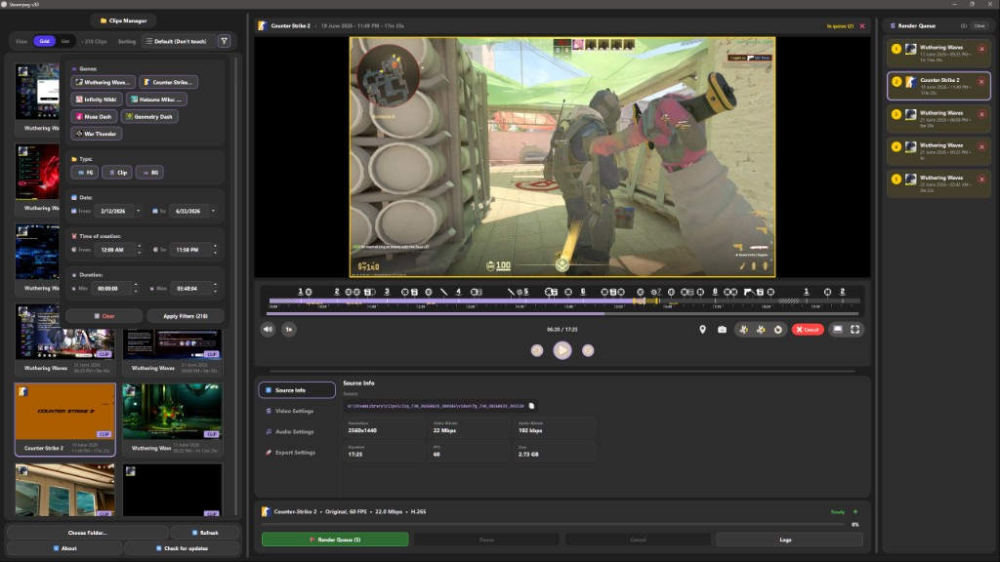
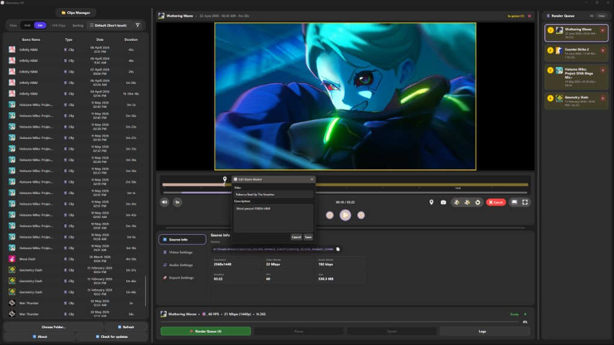
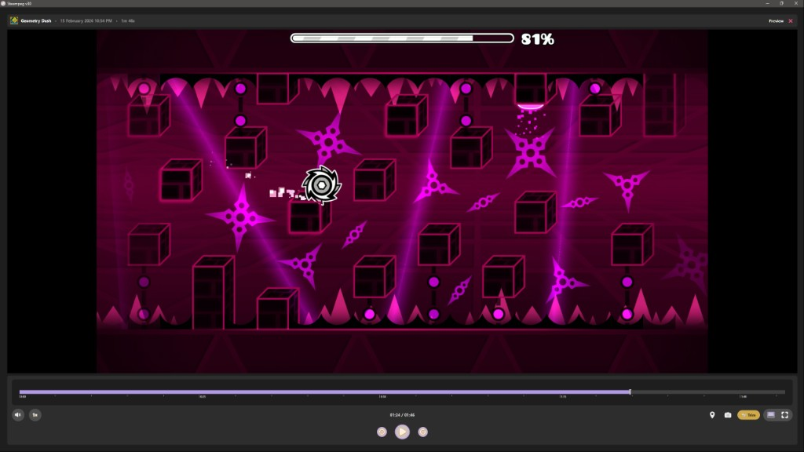
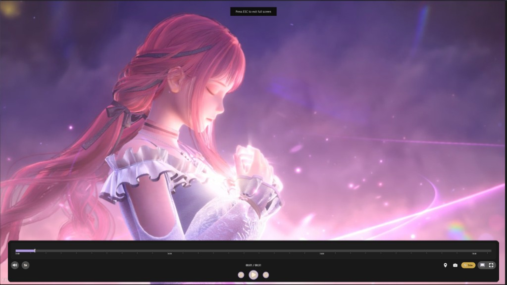

<p align="center">
  
</p>

<h1 align="center">Steempeg</h1>

<p align="center">
  <strong>A fast, hardware-accelerated renderer for Steam Game Recording clips.</strong><br>
  Recover broken recordings, trim with precision, and export in one click — no Python, no command line.
</p>

<p align="center">
  <a href="https://github.com/applejuicy23/steempeg/releases/latest">
    
  </a>
  
  
  <a href="https://github.com/applejuicy23/steempeg/stargazers">
    
  </a>
  <a href="https://github.com/applejuicy23/steempeg/releases">
    
  </a>
</p>

<p align="center">
  <a href="#-features">Features</a> ·
  <a href="#-screenshots">Screenshots</a> ·
  <a href="#-getting-started">Getting Started</a> ·
  <a href="#-whats-new-in-v30">What's New</a> ·
  <a href="#-credits">Credits</a>
</p>

---

## ✨ Features

| | |
|---|---|
| **Clips library** | Grid & List views, smart filters (game, date, duration), multi-select |
| **Player** | Trim mode, timeline markers, screenshots, theatre & fullscreen |
| **Render engine** | NVENC / CPU, H.264 & H.265, quality presets + custom bitrate |
| **Render queue** | Batch multiple clips, reorder, pause / cancel, persistent between sessions |
| **Steam-aware** | Auto-discovers clip folders, repairs broken block-spliced recordings |
| **Export** | Original stream copy, target file size, audio-only / mute options |

---

## 📸 Screenshots

<p align="center"><em>Clips manager with filters, grid view & render queue</em></p>
<p align="center">
  
</p>

<p align="center"><em>List view, marker editing & batch queue</em></p>
<p align="center">
  
</p>

<p align="center"><em>Grid library & source info panel</em></p>
<p align="center">
  
</p>

<p align="center"><em>Theatre mode — immersive playback</em></p>
<p align="center">
  
</p>

---

## 🚀 Getting Started

No installer. No dependencies. Extract and run.

1. Open **[Releases](https://github.com/applejuicy23/steempeg/releases/latest)** and download the latest `.zip`.
2. Extract the archive to any folder.
3. Run **`Steempeg.exe`**.
4. Point the app at your Steam clips folder (or let it auto-detect), pick a clip, set quality, hit **Start**.

### Requirements

- **Windows 10 / 11** (64-bit)
- **NVIDIA GPU** — optional, for NVENC hardware encoding
- **Steam Game Recording** clips (`clip_*` folders with `.mpd` manifests)

<details>
<summary><b>Alternative: download with GitHub CLI</b></summary>

If you have [GitHub CLI](https://cli.github.com/) installed:

```bash
gh release download -R applejuicy23/steempeg --pattern "*.zip" --dir .
```

Then extract and run `Steempeg.exe`.

</details>

---

## 🆕 What's New in v30

- **Major codebase refactor** — modular architecture, easier to maintain and extend
- **Redesigned render panel** — cleaner Video / Audio / Export tabs with live summary
- **Render queue** — batch renders, drag-to-reorder, survives app restarts
- **Clips manager** — Grid + List views, advanced filters, Ctrl/Shift multi-select
- **Player upgrades** — auto-loaded marker icons, trim highlights, screenshot toasts
- **Source info** — per-directory paths with individual copy buttons
- **Quality engine** — resolution-aware bitrate estimates, Original preset warnings
- **Stability** — fullscreen fixes, smoother splitter resize during playback, ESC no longer closes the app

Full changelog: [Releases](https://github.com/applejuicy23/steempeg/releases).

---

## 🛠️ Built With

Steempeg stands on the shoulders of giants:

| Project | Role |
|---|---|
| [**FFmpeg**](https://github.com/ffmpeg/ffmpeg) | Video encoding, decoding & muxing |
| [**PyAV**](https://github.com/pyav-org/pyav) | Python bindings for libav |
| [**MPV**](https://github.com/mpv-player/mpv) | In-app video playback |
| [**PySide6**](https://www.qt.io/qt-for-python) | Desktop UI framework |

---

## 🤝 Contributing & Issues

Found a bug or have an idea? Open an **[Issue](https://github.com/applejuicy23/steempeg/issues)** — feedback is welcome.

This is primarily a solo project; PRs are appreciated but may take time to review.

---

## ⚠️ Disclaimer

*Steempeg is an unofficial, community-created tool. Not affiliated with, associated with, authorized, or endorsed by Valve Corporation or Steam.*

---

<p align="center">
  Made with care by <a href="https://github.com/applejuicy23">Emily</a> 🎀
  · <a href="https://steamcommunity.com/id/applejuicy23/">Steam</a>
</p>
