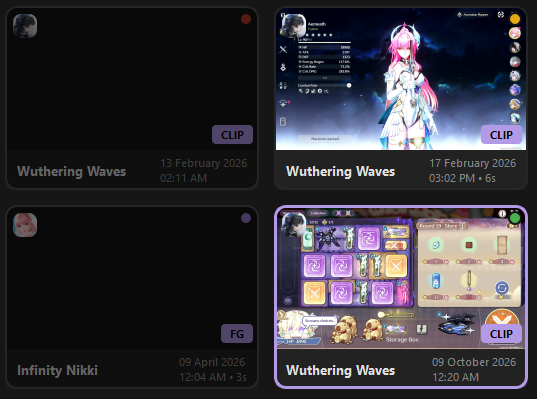
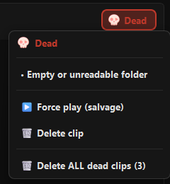
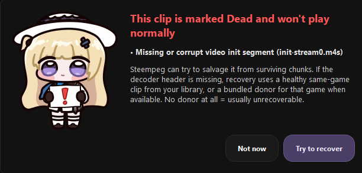

# Clip health

Steam records clips as **DASH**: a manifest (`session.mpd`) plus many small
video and audio chunk files. If Steam crashes, the disk fills up, or a folder
is partly deleted, a clip can lose pieces and stop playing. Steempeg checks
every clip and labels it with one of four health states.

---

## The four states

| State | Dot | Plays? | Can render? | Meaning |
|---|---|---|---|---|
| **Healthy** | 🟢 green | Yes | Yes | Nothing wrong found. |
| **Issues** | 🟡 amber | Yes | Yes | Plays, but something is off (see the list below). |
| **Dead** | 🔴 red | No | No | Cannot play normally. The card is dimmed. |
| **Cured** | 🟣 purple | Via salvage | Yes | Was Dead, but salvage playback was verified. See [Repair & salvage](repair-salvage.md). |

*Top row: Dead, Issues. Bottom row: Cured, Healthy.*

---

## Where you see health

### On the card

A small coloured **dot** in the top-right corner of every ClipCard. Dead cards
are also dimmed.

### In the player header

When a clip is open, the header shows a tinted **health button** with an icon
and label (`Healthy`, `Issues`, `Dead`, `Cured`). Hover it for a one-line
summary; click it for the full list of problems.

For **Dead** clips the menu also offers:

- **▶️ Force play (salvage)** — see [Repair & salvage](repair-salvage.md#salvage-force-play);
- **🗑️ Delete clip**;
- **🗑️ Delete ALL dead clips (N)** — asks first; Cured clips are never included.

### In Filters and Sorting

- **Filters → 💚 Health** has chips for *Healthy*, *Issues*, *Dead* and
  *Cured*.
- **Sorting → Bad health first / Good health first** puts the worst (or best)
  clips on top.

---

## What Steempeg checks

Checks run on the files in the clip folder, in this order.

### Dead

A clip is **Dead** when any of these is true:

| Problem | Shown as |
|---|---|
| The video init segment (the decoder header, `init-stream0.m4s`) is missing or empty | `Missing or corrupt video init segment (init-stream0.m4s)` |
| No video chunks left on disk (empty chunk files do not count) | `No video chunks on disk` |
| The manifest exists but cannot be read | `Cannot read manifest` |
| The manifest fails a real open test (see *ffprobe* below) | `Manifest cannot be opened (unplayable)` |
| Video chunks exist but there is no manifest at all | `Video chunks present but no playable manifest` |
| The folder is empty or unreadable | `Empty or unreadable folder` |

### Issues

A clip has **Issues** when it plays but any of these is found:

| Problem | Shown as |
|---|---|
| No audio track (no audio header or no audio chunks) | `No audio track on disk` |
| Steam's manifest was lost and Steempeg rebuilt one from the chunks | `Reconstructed manifest only (no original session.mpd)` |
| The manifest claims a much longer clip than survives on disk (less than 30 s left and the claim is more than 5× that) | `Manifest claims Ns but only K video chunk(s) survive (~Ss on disk)` |
| Audio and video start 1 second or more apart | `Audio/video start offset …` |
| A jump of more than 30 seconds between the first video fragments | `Corrupt decode timeline jump: …` |

Anything else is **Healthy**.

### ffprobe open test

For suspicious clips — rebuilt manifest, no audio, two or fewer video chunks,
a timeline jump, or a length mismatch — Steempeg also asks **ffprobe** to open
the manifest (6-second limit). If ffprobe cannot open it, the clip is Dead.
This test runs only in **Full** checks, not in quick ones.

!!! info "Clips with several recordings inside"
    Some Steam clips contain more than one recording folder. Steempeg checks
    each one and shows the **worst** result.

---

## When health is checked

Results are cached in `clip_health_cache.json` and reused while the clip
folder is unchanged.

| Situation | Check |
|---|---|
| **Progressive** startup *(default)* | Cache, or a quick file check without ffprobe. |
| **Quick** startup | Cache, or a quick file check. |
| **Full** startup | Full check with ffprobe (cache still used when the folder is unchanged). |
| **Skip** startup | No check — shows last session's labels. |
| Adding / choosing a clips folder, Steam auto-discovery | Full check of the new clips. |
| **Refresh** | Full scan. |

### Re-checking health

**Refresh ▾ → 🩺 Re-check clip health (ffprobe)…** ignores the cache and runs
the full check (with ffprobe) on every clip. The status bar shows progress
(`Re-checking clip health (done/total)…`), and a summary dialog lists how many
clips are Healthy, Issues and Dead.

Use it after you moved, restored or edited clip folders by hand, or when a
label looks wrong.

---

## What each state allows

| | Healthy | Issues | Dead | Cured |
|---|---|---|---|---|
| Play in the player | ✅ | ✅ | ❌ *offers salvage* | ✅ *via salvage* |
| Add to Render Queue | ✅ | ✅ | ❌ *skipped* | ✅ |
| Render (any preset, incl. Original) | ✅ | ✅ | ❌ | ✅ |
| Delete | ✅ | ✅ | ✅ | ✅ |

When you open a **Dead** clip, the player does not start. Instead a
**Dead Clip** dialog lists the problems and offers **Try to recover**. A Dead
clip already in the queue fails with
`Source clip is Dead and cannot be rendered.`

---

## Next

- [Repair & salvage](repair-salvage.md) — how Steempeg fixes clips and brings
  Dead ones back
- [Clips Manager](clips-manager.md) — cards, selection, filters
