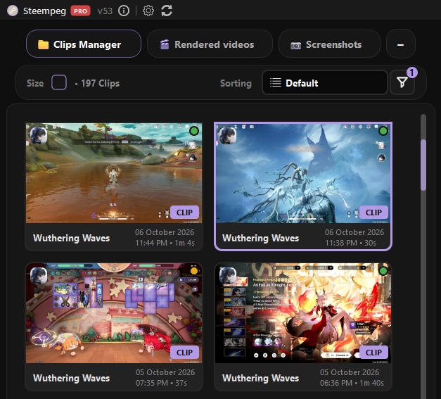
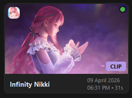
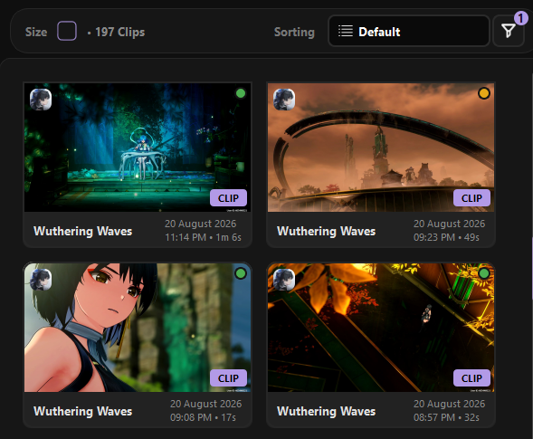
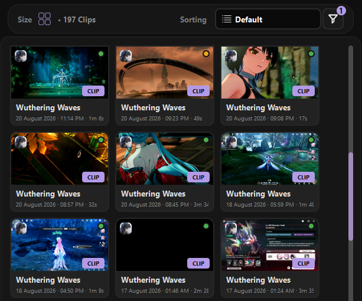
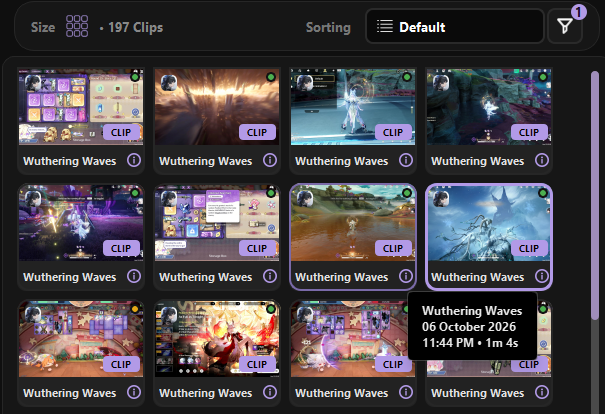
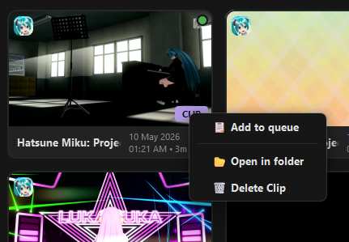
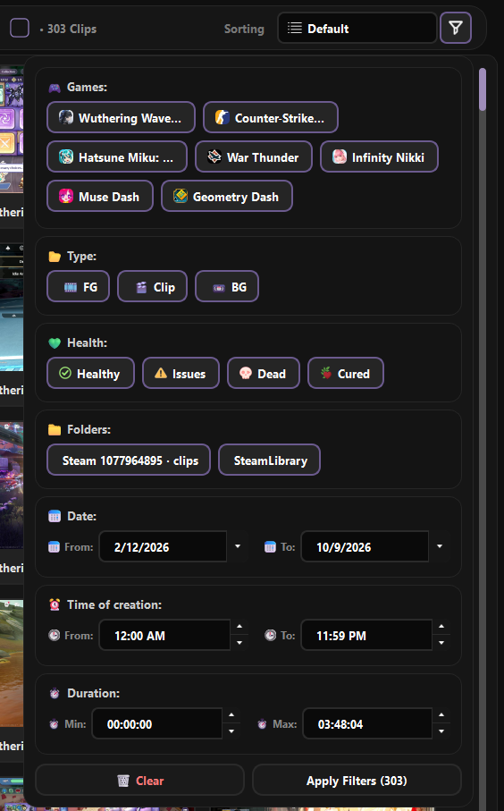

# Clips Manager

Clips Manager is the library panel that lists every Steam Game Recording clip
Steempeg found in your clip folders. Each clip is a **ClipCard**. Clicking a
card opens the clip in the player and loads it into the render settings.

---

## Panel layout

| Area | What is there |
|---|---|
| **Tab** | `📁 Clips Manager` (shortens to `📁 Clips` in narrow windows). Tabs can be dragged to reorder; hover a tab for its `×` close button; `+` adds or removes library panels. |
| **Toolbar** | **Size** button, clip count (`• 253 Clips`, or `• … Clips` while scanning), **Sorting** dropdown, **Filters** funnel. |
| **Cards** | The grid of ClipCards. |
| **Footer** | `📂 Choose Folder…` with `+`, and `🔄 Refresh` with `▾`. |

---

## What a ClipCard shows

| Part | Where | Meaning |
|---|---|---|
| **Thumbnail** | Top of the card | A frame from the clip. While it is being generated the card is dimmed; it lights up when the poster arrives. |
| **Game icon** | Top-left corner | The game the clip was recorded in. Unknown games get a round placeholder icon. |
| **Health dot** | Top-right corner | Clip health at a glance — see [Clip health](clip-health.md). |
| **Type badge** | Bottom-right corner | Lavender badge: **CLIP**, **BG** (background recording) or **FG**. |
| **Queue number** | Bottom-left corner | Shown only while the clip is in the Render Queue: the job's position, coloured by job status. If the same clip is queued several times, the number cycles through each job. |
| **Footer** | Under the thumbnail | Game name, date, time and duration. Layout depends on card size. |

A **dimmed card** means either the thumbnail is not ready yet, or the clip is
**Dead** (see [Clip health](clip-health.md#dead)).

After you click a card, a spinner with a percentage appears over its thumbnail
until the clip is loaded in the player.

### Card styles

**Settings → Visual → Library cards → ClipCard style**

| Style | Look |
|---|---|
| **SteempegUI** *(default)* | Top and bottom overlay rows sit flush with the card edges. |
| **Square** | Square top, rounded bottom. |
| **Round** | Rounded everywhere. |

Game icon corners have their own setting:
**Settings → Visual → Game icons → Corner shape** — *Square*, *Soft*
(Steam-like, default) or *Circle*.

---

## Card sizes

Click the **Size** button in the toolbar and pick a tile.

| Size | Card | Footer |
|---|---|---|
| **Big** *(default)* | 254 × 184 | Game name on the left; date on the right with `time • duration` under it. |
| **Medium** | 168 × 136 | Game name, then `date · time · duration` on one line (hover for the full text). |
| **Small** | 128 × 108 | Game name and an **i** glyph; hover it for the date, time and duration. |

=== "Big"

    

=== "Medium"

    

=== "Small"

    

!!! tip "Small cards: peek at the full thumbnail"
    On Small cards, rest the cursor on the thumbnail for **2 seconds** — the
    icon, badges and health dot fade out so you can see the whole frame. They
    come back when the cursor leaves.

### Classic list view

Prefer a table? Turn on
**Settings → Advanced → Library → Restore classic List view**. A fourth tile,
**List**, appears in the Size popup. The list has the columns
*Game Name*, *Type*, *Date* and *Duration*. Use **Sorting** to order it —
clicking the column headers does not sort.

---

## Selecting clips

| Action | Result |
|---|---|
| **Click** | Selects the card (purple border) and **opens the clip** in the player and render settings. Clicking the clip that is already open does nothing. |
| **Ctrl + click** / **Alt + click** | Adds or removes the card from the selection. Does not open anything. |
| **Shift + click** | Selects every visible card between the last plain click and this one. |
| **Click on empty space** | Keeps the current selection. |
| **Right-click** | Opens the context menu for the card(s) — never changes the selection. |

Multi-selection is what the context menu acts on: add several clips to the
queue, open their folders, or delete them at once.

!!! note
    While a library scan is running, the grid, Sorting and Filters are locked
    (`Wait until library finishes loading…`). They unlock as soon as the scan
    ends.

---

## Right-click menu

| Item | What it does |
|---|---|
| **📋 Add to queue** / **Add to queue (N)** | Adds the clip(s) to the Render Queue. **Dead** clips that are not Cured are skipped — the tooltip warns about it. |
| **📂 Open in folder** | Opens Explorer with the clip folder selected (one window per parent folder for several clips). |
| **🗑️ Delete Clip** / **Delete Clips (N)** | Deletes the clip folder(s) **permanently**, after a confirmation (can be turned off in *Settings → Advanced → Safety*). |

!!! tip "Bulk cleanup"
    For rule-based cleanup (by size, age, health, game…) with Recycle Bin
    support, use **Smart Deletor** in the Render Queue panel instead of
    deleting card by card.

---

## Sorting

The **Sorting** dropdown:

| Option | Order |
|---|---|
| **Default** | Newest recording first. |
| **Game Name (A - Z / Z - A)** | Alphabetical by game. |
| **Type (A - Z / Z - A)** | Clip / BG / FG. |
| **Bad health first** | Dead → Issues → Cured → Healthy. |
| **Good health first** | The reverse. |
| **Date (Oldest / Newest First)** | By recording date. |
| **Duration (Shortest / Longest)** | By clip length. |
| **Folder (A - Z / Z - A)** | By folder. |

---

## Filters

The funnel button opens the filter popup. A small badge on the funnel shows how
many filters are active.

| Section | Filters by |
|---|---|
| **🎮 Games** | One chip per game. |
| **📂 Type** | Clip / BG / FG. |
| **💚 Health** | Healthy / Issues / Dead / Cured (*Cured* appears once at least one clip is cured). |
| **📁 Folders** | One chip per library folder. |
| **📅 Date** | From / To dates. |
| **⏰ Time of creation** | From / To time of day. |
| **⏱ Duration** | Min / Max length. |

All chips start **on**. Hold the left mouse button and drag across chips to
switch a whole row on or off in one stroke. **Apply Filters (N)** shows how
many clips match before you apply; **🗑 Clear** resets everything.

{ width="420" }

---

## Folders and refresh

### 📂 Choose Folder… and `+`

**Choose Folder…** sets your main clips folder — the folder that **contains**
the `clip_*` folders, not a single clip. The `+` button opens
**Library folders**:

- the main folder is marked **★** and can be replaced without losing the
  others;
- every folder has a **remove** button; missing ones say
  *(Folder not found on disk)*;
- **🔍 Discover Steam folders…** finds Steam recording folders for you;
- **➕ Add another folder…** adds more roots; **🧹 Clear list** empties it.

### 🔄 Refresh and `▾`

**Refresh** rescans Clips Manager, Rendered videos and Screenshots. The `▾`
menu has narrower actions:

| Item | Does |
|---|---|
| **🔄 Refresh Clips Manager** | Rescans only the clip folders. |
| **🖼️ Refresh game icons from Steam…** | Re-downloads game icons. |
| **🏷️ Refresh game names from Steam…** | Re-resolves game names. |
| **🩺 Re-check clip health (ffprobe)…** | Full health pass on every clip, ignoring the cache — see [Clip health](clip-health.md#re-checking-health). |

---

## Startup modes and what cards show

**Settings → Performance → Library startup → On launch**

| Mode | What you see |
|---|---|
| **Progressive, load as you scroll** *(default)* | Cards build as they scroll into view. Durations may fill in a moment later. |
| **Quick, folders + cached health** | Rescans folders, reuses cached health. |
| **Full, first launch / new folder** | Full health check and Steam icon / name refresh on every launch. Slowest, most thorough. |
| **Skip, last session list** | Shows last session's list instantly from cache; new folders are added quietly afterwards. |

In every mode, missing thumbnails are generated in the background and pop into
the cards as they finish. **Refresh** always runs a full scan.

---

## Next

- [Clip health](clip-health.md) — what the health dot means
- [Repair & salvage](repair-salvage.md) — what happens to broken and Dead clips
