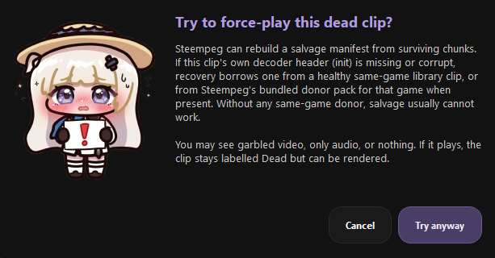
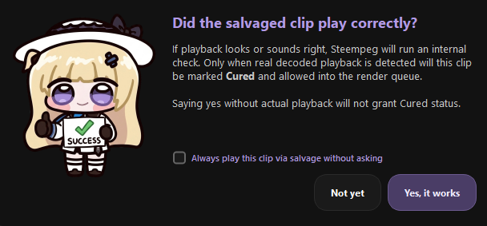
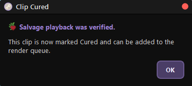

# Repair & salvage

Steempeg fixes broken clips in two ways:

- **Automatic repair** — silent, for every clip. Steam's manifests often point
  at the wrong chunks or start times; Steempeg writes a corrected copy and
  plays from that.
- **Salvage** — on request, for **Dead** clips. Steempeg rebuilds a playable
  manifest from whatever chunks survive. If it plays and the check passes,
  the clip becomes **Cured** and can be rendered again.

!!! success "Your original files are never touched"
    Steempeg never overwrites or deletes Steam's files. Every fix is written
    as a **new file next to the originals** (see [Files Steempeg adds](#files-steempeg-adds)).

---

## Automatic repair

There is no button — it happens whenever Steempeg opens, previews, thumbnails
or queues a clip.

### Fixed manifest

Steam's `session.mpd` describes the chunks loosely, which causes seek drift
(the famous "+6 seconds") and playback that stops early. Steempeg reads it,
lists the chunks that really exist on disk, and writes an exact
**`session_fixed.mpd`**:

- the timeline starts at zero;
- every surviving video and audio chunk is listed explicitly;
- the real start offset is read from the chunks, so seeking lands where you
  click.

If Steam updates `session.mpd` later, the fixed copy is rebuilt. If the fix
fails, Steempeg falls back to the original manifest.

### Rebuilt manifest

If a clip folder has chunks but **no manifest at all** (Steam crashed before
writing it), a library scan rebuilds one from scratch as
**`session_recovered.mpd`**, assuming Steam's standard 3-second chunks. The
clip then shows **Issues** with
`Reconstructed manifest only (no original session.mpd)` — it plays, but the
length may be approximate.

This needs the clip's own video header (`init-stream0.m4s`). Without it the
clip is **Dead** and only salvage can help.

---

## Salvage (force play)

Salvage is for **Dead** clips. There are two ways in:

1. **Open the Dead clip.** The **Dead Clip** dialog appears — click
   **Try to recover**.
2. **Health button in the player header → ▶️ Force play (salvage)**.

Confirm with **Try anyway**. Steempeg then:

1. Collects every surviving video chunk.
2. Checks the clip's own video header (`init-stream0.m4s`).
3. If the header is missing or broken, borrows one from a **donor**:
    1. a healthy clip of **the same game** in your library;
    2. otherwise a **bundled donor** shipped with Steempeg for that game.
4. Writes **`session_salvage.mpd`** (and, when a donor was used, a copy of its
   header as `init-stream0-salvage.m4s`).
5. Starts playback from the salvage manifest.

!!! warning "What you may see"
    Salvage is best effort. You might get garbled video, audio only, or
    nothing. The clip stays **Dead** until you confirm it played.

### Why donors work

Recordings of the same game usually share the same decoder header. A healthy clip of that game can stand in for the missing one.
A header from a **different** game will not work, so a Dead clip with no
same-game donor is usually unrecoverable.

!!! tip "No donor? Record one"
    Record a few seconds of the same game with Steam, let Steempeg pick it up,
    then try **Force play (salvage)** again.

---

## Becoming Cured

Once salvage playback starts, Steempeg asks:

> **Did the salvaged clip play correctly?**

- **Yes, it works** — Steempeg runs an internal check: the player must be
  running the salvage manifest **and** must have decoded a real frame or
  played at least about a third of a second. Saying yes without real
  playback does not count.
- **Not yet** — the clip stays Dead.

Tick **Always play this clip via salvage without asking** to skip the dialogs
next time you open it.

When the check passes, the **Clip Cured** dialog confirms it and:

{ width="380" }

- the health dot turns **purple** and the header shows **Cured**;
- the clip can be added to the Render Queue and rendered (from the salvage
  manifest);
- a **Cured** chip appears in **Filters → Health**;
- the status is remembered across restarts.

If the check fails you get **Could not verify playback** with the reason
(for example *No decoded playback was detected.*), and the clip stays Dead.

!!! info "Cured is a label, not a rewrite"
    The files on disk are still damaged — a Cured clip simply has a verified
    way to play. **Re-check clip health** will still see it as Dead underneath,
    but the Cured label stays. Deleting the clip clears it.

---

## When salvage cannot help

**Nothing to salvage — Could not recover this clip** appears when:

- there are **no usable video chunks**, or
- the video header is gone **and** no same-game donor exists (library or
  bundled).

Damage inside the video itself cannot be undone either, and the audio header
is never borrowed, so some salvaged clips play **without sound**.

---

## Files Steempeg adds

All of them sit in the clip folder next to Steam's files. Nothing is deleted
or overwritten.

| File | Written by | Purpose |
|---|---|---|
| `session_fixed.mpd` | Automatic repair | Exact manifest for accurate playback and seeking. |
| `session_recovered.mpd` | Library scan | Rebuilt manifest when Steam's is missing. |
| `session_salvage.mpd` | Salvage | Best-effort manifest for a Dead clip. |
| `init-stream0-salvage.m4s` | Salvage | Copy of a donor's video header. |

Leave them in place: Steempeg reuses them, and a Cured clip plays and renders
through its `session_salvage.mpd`.

---

## Next

- [Clip health](clip-health.md) — the four states and every check
- [Clips Manager](clips-manager.md) — cards, selection, filters
